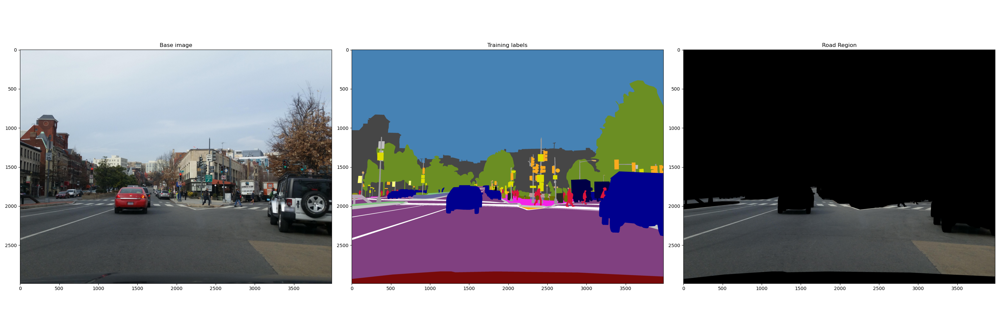
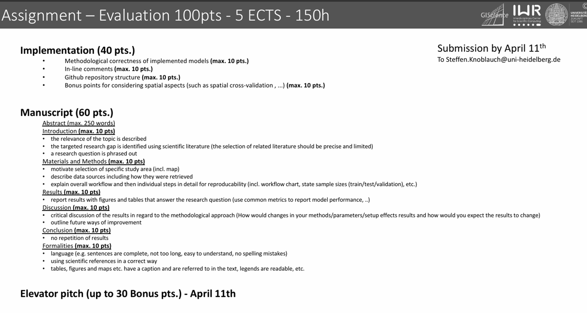

## Research Proposal

### 1. Training Tasks
* Road segmentation
* Road surface classification (asphalt, concrete, paving stones, sett, unpaved)

### 2. Dataset Fusion
* [StreetSurfaceVis](https://zenodo.org/records/11449977): detailed road surface types and qualities s with Mapillary contributor names and image IDs.  
* Mapillary Vistas Dataset: provides various road types labels, but for surface classification need additional labellings

### 3. Model Desigin
* Feature extraction (ResNet, EfficientNet)
* Multi-Task model (combine segmentation and classification for sharing features)

### 4. Data Preprocessing
#### 4.1 Extract the road region from Mapillary Vistas Dataset
* create a mask, including labels from the origin dataset

        "construction--flat--road",               
        "construction--flat--crosswalk-plain",  
        "marking--discrete--crosswalk-zebra",  
        "marking--discrete--arrow--left",    
        "marking--discrete--arrow--right",   
        "marking--discrete--arrow--straight",  
        "marking--discrete--stop-line",  
        "marking--continuous--dashed",  
        "marking--continuous--solid",   
        "marking--discrete--symbol--bicycle", 
        "construction--flat--bike-lane",
        "construction--flat--service-lane"

#### 4.2 Pre-training model for surface classification based on StreetSurfaceVis

#### 4.3 Fine-tuning model on Mapillary Vistas Dataset (transfer learning)

#### 4.4 Multi-task learning- segmentation & Classification

### References
[1] Kapp, Alexandra, Edith Hoffmann, Esther Weigmann, and Helena Mihaljević. “StreetSurfaceVis: A Dataset of Crowdsourced Street-Level Imagery Annotated by Road Surface Type and Quality.” Scientific Data 12, no. 1 (January 16, 2025): 92. https://doi.org/10.1038/s41597-024-04295-9.

## Paper Timetable

